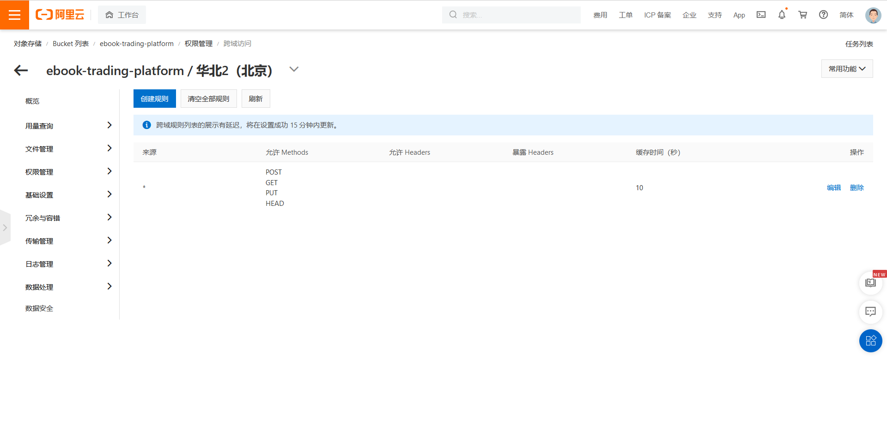

# 摘要

参考 [官方文档：服务端签名后直传](https://help.aliyun.com/document_detail/31926.html) 、[SpringCloud整合OSS对象存储](http://www.jayh.club/#/02.PassJava%E6%9E%B6%E6%9E%84%E7%AF%87/12.SpringCloud%E6%95%B4%E5%90%88OSS%E5%AF%B9%E8%B1%A1%E5%AD%98%E5%82%A8) 完成 spring boot + vue 阿里云 OSS 服务端签名后直传

# 跨域处理

https://help.aliyun.com/document_detail/44199.html 

# 遇到的问题

前端 `beforeUpload` 方法中需要同步，否则后端还没返回，文件就开始上传了，导致上传失败。解决方法见 [axios 开启同步的方法.html](assets\references\axios 开启同步的方法.html) 

