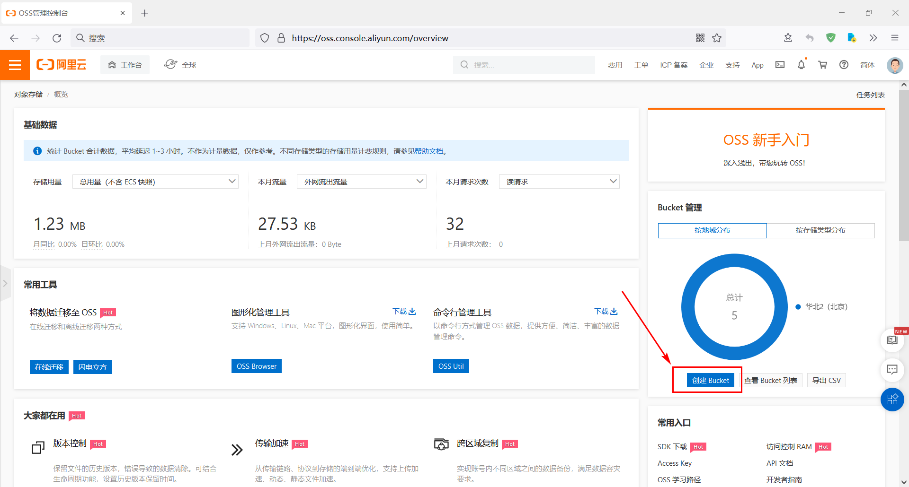

# 摘要

阿里云oss服务准备工作

# 目标

1. AccessKey
2. Bucket 
3. endpoint : [公共云下OSS Region和Endpoint对照表](https://help.aliyun.com/document_detail/31837.html) 

# 步骤

## 开启oos 服务

 https://oss.console.aliyun.com/overview 

## 创建 Bucket

## AccessKey

登录阿里云后，在左上角有你的头像，把鼠标放在你的头像上，就会出现你的一些信息。在出现的信息中点击 **AccessKey 管理** ，就进入了 [AccessKey 管理界面]( https://ram.console.aliyun.com/manage/ak )，然后你就可以创建 AccessKey 了

